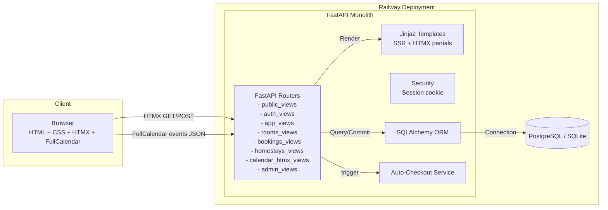
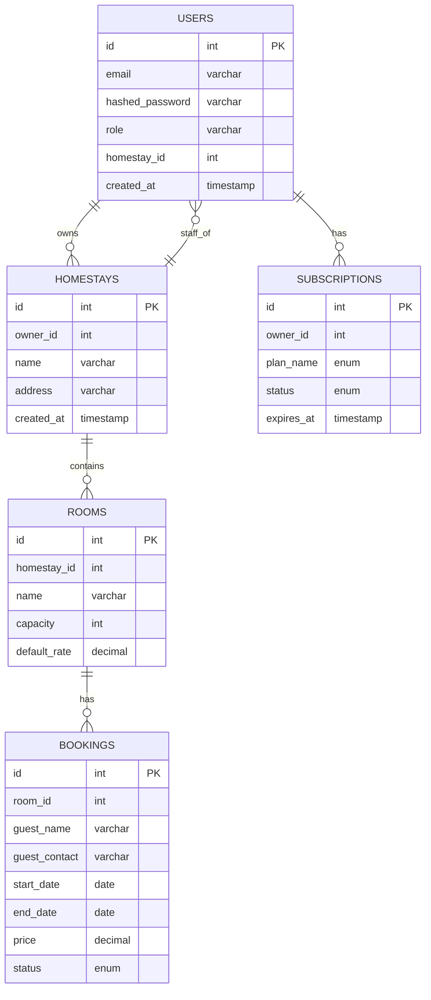

# GoStayPro — Property Room & Booking Management (Up-to-date Overview)

GoStayPro is a calendar-first, multi-tenant room management and booking web application designed for small properties, guesthouses, and B&Bs. The philosophy is simplicity, affordability, and a powerful, visually-driven calendar interface. This README reflects the current implemented codebase and how to run and deploy it.

---

## 1. Business Idea & Value Proposition

- Problem: Small homestay owners often rely on cumbersome spreadsheets, paper calendars, or expensive, overly complex Property Management Systems (PMS). They need a simple, affordable, and centralized way to view room availability, manage bookings, and track guest information.
- Solution: StayCal provides a clean, calendar-first web application that focuses on booking management. It is built for low operational costs, enabling an affordable subscription model.
- Target Audience: Small hospitality operators (1–15 rooms): homestays, guesthouses, B&Bs, boutique inns.
- Monetization: Tiered monthly/annual subscriptions:
  - Free: 1 user, up to 2 rooms.
  - Basic: Up to 5 users, up to 10 rooms.
  - Pro: Unlimited users, unlimited rooms.

---

## 2. Current MVP Features (implemented)

- Public Landing Page
  - Marketing-style landing with hero, graphics, and CTAs to Register/Login.

- Authentication (session-based)
  - Register, Login, Logout.
  - Secure, server-signed cookie stored in the browser.

- Dashboard (/app)
  - Onboarding stepper to guide Property → Rooms → Booking.
  - Today’s operational widgets: incoming Check-ins and Check-outs for the active property.
  - FullCalendar per-room calendar with event colors by status and quick selection to create bookings.

- Calendar & Bookings
  - FullCalendar on the client, backed by a JSON events endpoint: GET /htmx/calendar/events.
  - Booking creation modal via HTMX: GET /htmx/booking/new (returns HTML fragment).
  - Save booking via HTMX: POST /htmx/booking/save (emits HX-Trigger bookingSaved to refresh calendars).
  - Prevents double-booking (overlap conflict detection per room).
  - Booking statuses: tentative, confirmed, checked_in, checked_out, cancelled.
  - Auto-checkout: any booking whose end_date is in the past is automatically set to checked_out on key views.

- Homestays (CRUD)
  - Owner creates/edits/deletes homestays.
  - Set active homestay for current session.

- Rooms (CRUD)
  - Manage rooms for the active homestay (name, capacity, default_rate).

- Bookings (CRUD)
  - Create, edit, delete bookings; overlap conflicts prevented.
  - Price and all money values displayed as THB with thousand separators (e.g., ฿1,234.00).

- Overview (/app/overview)
  - Stats per property: nights, bookings count, profit (sum of booking prices), rooms count.
  - Today’s counts per property: Check-ins Today, Check-outs Today.
  - Upcoming Check-ins list for the active property.
  - Period-based stats filter (start/end). Defaults to current month if no period provided.

- Admin
  - /admin shows lists of Users, Properties, Subscriptions for admin users.
  - /admin/plans lets admins assign or update a user's subscription (plan, status, expiry).

---

## 3. High-Level Architecture

- Frontend: HTML5 + Tailwind CSS. Interactivity via HTMX for partial HTML updates and FullCalendar for the dashboard calendar UI.
- Backend: Monolithic FastAPI service handling auth, business logic, DB access, and Jinja2 template rendering.
- Database: SQLAlchemy ORM. Defaults to SQLite locally; supports PostgreSQL in production (Railway).
- Deployment: Dockerized; designed to run on Railway with a managed PostgreSQL.

Mermaid diagram:



---

## 4. Detailed Architecture & Routes

- Web Framework: FastAPI
- Server: Uvicorn
- Templates: Jinja2
- Interactivity: HTMX 1.9+ and FullCalendar 6.x via CDN
- ORM: SQLAlchemy 2.0
- Auth: Session cookie via itsdangerous

---

## 5. Data Structure and Relations

Core tables and fields are defined in the SQLAlchemy models. See `app/models.py` for details. The ER diagram below provides an overview.



---

## 6. Technology Stack

- Python 3.10+
- FastAPI + Uvicorn
- SQLAlchemy 2.0 + Alembic
- PostgreSQL (production) / SQLite (local)
- Jinja2 templates
- HTMX 1.9+
- FullCalendar 6.x
- Tailwind CSS (via CDN)
- Docker & Docker Compose

---

## 7. Local Development

### Quick Start (Script)
```bash
bash run_local.sh
```
This script sets up the virtual environment, installs dependencies, and starts the Uvicorn server with live reload.

### Manual Setup
1.  Create and activate a virtualenv: `python -m venv .venv && source .venv/bin/activate`
2.  Install dependencies: `pip install -r requirements.txt`
3.  Copy `.env.example` to `.env` and configure variables.
4.  Run database migrations: `alembic upgrade head`
5.  Start the server: `uvicorn app.main:app --reload`

---

## 8. Deployment on Railway

The application is optimized for deployment on Railway using Docker. The deployment process is configured using `Railway.toml` and a multi-stage `Dockerfile`.

### Key Configuration:

-   **`Railway.toml`**:
    -   Specifies a Dockerfile-based build.
    -   Uses a `releaseCommand = "alembic upgrade head"` to run database migrations safely during the release phase.
    -   Includes a health check at the `/healthz` endpoint.

-   **`Dockerfile`**:
    -   **Multi-Stage Build:** Uses a two-stage build to create a lean, secure final image. The first stage builds the Python dependencies, and the second stage copies them into a clean image with the application source code.
    -   **Non-Root User:** Creates and runs the application as a non-root `appuser` for improved security.
    -   **Entrypoint Script:** Uses an `entrypoint.sh` script to handle application startup.

### Deployment Steps:

1.  **Provision Services:**
    -   Create a **PostgreSQL** service on Railway.
    -   Create a new service and connect it to your GitHub repository. Railway will automatically detect the `Dockerfile` and `Railway.toml`.

2.  **Configure Environment Variables:**
    -   In the Railway service dashboard, go to the **Variables** tab.
    -   Railway will automatically inject the `DATABASE_URL` from the PostgreSQL service.
    -   Add a `SECRET_KEY` and set it to a strong, randomly generated value.
    -   Optionally, add `CLOUDINARY_URL` to enable image uploads.

3.  **Deploy:**
    -   Pushing to your main branch will trigger a new deployment on Railway.
    -   During the deployment, Railway will first run the `releaseCommand` (`alembic upgrade head`) and then start the application service.
    -   Once deployed, Railway will provide a public domain to access the application.

---

## 9. Database Migrations (Alembic)

The app uses Alembic for database migrations.

-   **Local Usage:**
    -   Apply migrations: `alembic upgrade head`
    -   Generate a new migration: `alembic revision --autogenerate -m "your message"`

-   **Docker/Railway:**
    -   On Railway, migrations are run automatically during the release phase via the `releaseCommand`.
    -   For local Docker development, the `entrypoint.sh` script runs migrations before starting the application.
