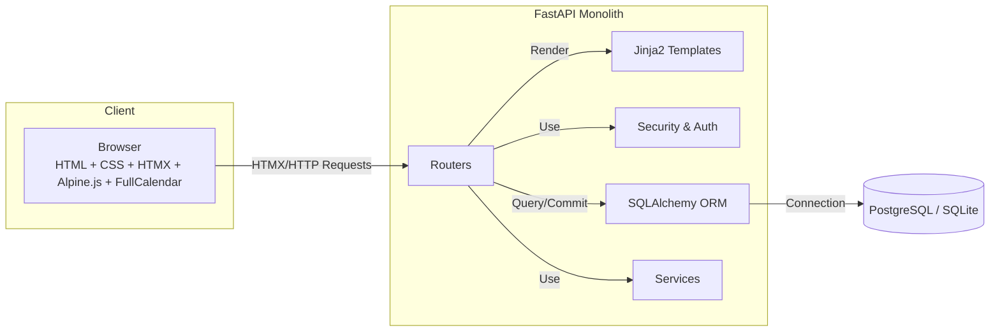
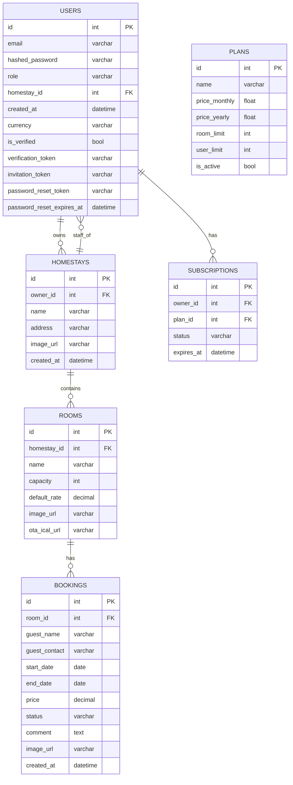

# GoStayPro — Property Room & Booking Management

GoStayPro is a calendar-first, multi-tenant room management and booking web application designed for small properties, guesthouses, and B&Bs. The philosophy is simplicity, affordability, and a powerful, visually-driven user interface.

---

## 1. Core Features (Implemented)

-   **Modern, Responsive UI:**
    -   A professional, responsive design that works seamlessly on desktop and mobile devices.
    -   Consistent sidebar navigation for both the main user application and the admin panel.

-   **Visual Booking Calendar:**
    -   A dashboard centered around a multi-room calendar view powered by FullCalendar.
    -   Color-coded bookings by status (Tentative, Confirmed, Checked-in, etc.).
    -   Click-and-drag on the calendar to create a new booking with pre-filled dates.
    -   Click a booking to go to the full-page edit form.

-   **Comprehensive Booking Management (CRUD):**
    -   Full-page forms for creating, editing, and deleting bookings.
    -   Automatic conflict detection to prevent double bookings.
    -   Support for guest details, contact information, price, and private comments.

-   **Property & Room Management (CRUD):**
    -   Multi-property support: users can create and manage multiple homestays.
    -   Set an "active" property for the main dashboard view.
    -   Full CRUD for rooms within each property, including name, capacity, default rate, and an image.

-   **Powerful Analytics & Reporting:**
    -   A dedicated Analytics page with a filterable date range.
    -   Key industry metrics: **Occupancy Rate**, **Average Daily Rate (ADR)**, and **Revenue Per Available Room (RevPAR)**.
    -   Advanced insights: **Average Length of Stay (ALOS)** and **Average Booking Lead Time**.
    -   A bar chart visualizing monthly revenue over the last 6 months.
    -   Data export functionality to download booking reports as **PDF** or **CSV**.

-   **User & Team Management:**
    -   **Staff Invitations:** Property owners can invite team members via email to manage their properties.
    -   Invited users get a secure, one-time link to set their password and join the team.

-   **Secure Authentication:**
    -   Full user authentication flow: Register, Login, Logout.
    -   Secure, configurable session management with long-lasting cookies.
    -   **Forgot Password:** A complete, secure password reset workflow via email.
    -   **Change Password:** Users can change their own passwords from their settings page.

-   **Admin Panel:**
    -   A dedicated admin section with its own sidebar navigation.
    -   **User Management:** Admins can create, edit, and delete any user.
    -   **Subscription Management:** Admins can assign subscription plans to users and manage plan details.
    -   **Configurable Admin Notifications:** Admins can opt-in to receive an email notification (to a globally configured address) whenever a new user successfully onboards.

-   **Modern Tech Stack:**
    -   **HTMX-powered UI:** Key interactions like the image preview modal are powered by HTMX for a smooth, single-page application feel without the complexity of a large JavaScript framework.
    -   **Cloudinary Integration:** For robust, cloud-based image hosting.

---

## 2. High-Level Architecture

-   **Frontend:** HTML5 + Tailwind CSS. Interactivity is primarily handled by **HTMX** for partial HTML updates, with targeted use of **Alpine.js** and **FullCalendar** for specific components.
-   **Backend:** Monolithic FastAPI service handling auth, business logic, DB access, and Jinja2 template rendering.
-   **Database:** SQLAlchemy ORM. Defaults to SQLite locally; supports PostgreSQL in production.
-   **Deployment:** Fully Dockerized and designed for one-click deployment on platforms like Railway.



---

## 3. Data Structure

Core tables and fields are defined in the SQLAlchemy models. See `app/models/` for details.



---

## 4. Local Development (Docker Recommended)

The recommended way to run the project locally is with Docker Compose, as it perfectly mirrors the production environment.

1.  **Configure Environment:**
    -   Copy `.env.example` to `.env`.
    -   Fill in the required variables, especially `SECRET_KEY`.

2.  **Build and Run:**
    ```bash
    docker-compose up --build
    ```
    -   The `--build` flag ensures the Docker image is rebuilt with the latest code and dependencies.
    -   The application will be available at `http://localhost:8000`.
    -   The `entrypoint.sh` script will automatically run database migrations (`alembic upgrade head`) on startup.

### Manual Setup (Alternative)

If you prefer not to use Docker:

1.  Create and activate a virtualenv: `python -m venv .venv && source .venv/bin/activate`
2.  Install dependencies: `pip install -r requirements.txt`
3.  Copy `.env.example` to `.env` and configure variables.
4.  **Run database migrations:** `alembic upgrade head`
5.  Start the server: `uvicorn app.main:app --reload`

---

## 5. Environment Variables

The application is configured via environment variables defined in the `.env` file.

| Variable                          | Description                                                                 |
| --------------------------------- | --------------------------------------------------------------------------- |
| `SECRET_KEY`                      | **Required.** A long, random string for signing session cookies.              |
| `DATABASE_URL`                    | **Required.** The connection string for your database (e.g., PostgreSQL).     |
| `SESSION_MAX_AGE_DAYS`            | How long a user stays logged in. Defaults to `30`.                          |
| `ADMIN_EMAIL`                     | The email for the default admin user, created on first startup.             |
| `ADMIN_PASSWORD`                  | The password for the default admin user.                                    |
| `ADMIN_NOTIFICATION_EMAIL`        | The email address to send new user notifications to.                        |
| `ADMIN_NOTIFICATION_EMAIL_ENABLE` | Set to `true` to enable new user notifications.                             |
| `CLOUDINARY_URL`                  | Optional. Your Cloudinary connection string to enable cloud image uploads.  |
| `MAILGUN_API_KEY`                 | Optional. Your Mailgun API key for sending emails.                          |
| `MAILGUN_DOMAIN`                  | Optional. Your Mailgun domain.                                              |
| `RECAPTCHA_SITE_KEY`              | Optional. Google reCAPTCHA v3 site key.                                     |
| `RECAPTCHA_SECRET_KEY`            | Optional. Google reCAPTCHA v3 secret key.                                   |

---

## 6. Database Migrations (Alembic)

The app uses Alembic for database schema migrations.

-   **Generate a new migration:**
    ```bash
    alembic revision --autogenerate -m "Your descriptive message"
    ```
-   **Apply migrations:**
    ```bash
    alembic upgrade head
    ```

In the Docker environment, migrations are run automatically by the `entrypoint.sh` script on startup.
