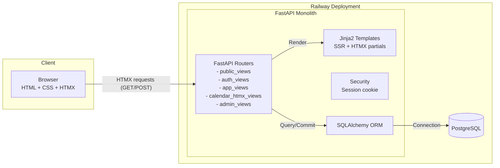

# StayCal — Homestay Room & Booking Management (Project Plan)

StayCal is a calendar-first, multi-tenant room management and booking web application designed for small homestays, guesthouses, and B&Bs. The philosophy is simplicity, affordability, and a powerful, visually-driven calendar interface. This document outlines the comprehensive project plan for StayCal per the provided guidelines.

---

## 1. Business Idea & Value Proposition

- Problem: Small homestay owners often rely on cumbersome spreadsheets, paper calendars, or expensive, overly complex Property Management Systems (PMS). They need a simple, affordable, and centralized way to view room availability, manage bookings, and track guest information.
- Solution: StayCal provides a clean, calendar-first web application that focuses exclusively on booking management. It is built for low operational costs, enabling an affordable subscription model.
- Target Audience: Small hospitality operators (1–15 rooms): homestays, guesthouses, B&Bs, boutique inns.
- Monetization: Tiered monthly/annual subscriptions:
  - Free: 1 user, up to 2 rooms.
  - Basic: Up to 5 users, up to 10 rooms.
  - Pro: Unlimited users, unlimited rooms.

---

## 2. MVP (Minimum Viable Product) Features

- Admin Superuser:
  - Dashboard to view all registered businesses/users.
  - Manage subscription plans and manually activate/deactivate subscriptions.
- Business/Homestay Owner (Tenant):
  - Onboarding: Simple sign-up and homestay profile (name, address, etc.).
  - Subscription: Select a plan (MVP can be manual activation or “Contact Us”).
  - Room Management: CRUD for rooms with attributes: name, capacity, default rate.
  - User Management: Invite/add staff with limited permissions (no deletion of rooms or subscription management).
- Core Feature: Calendar Management (primary dashboard)
  - Visual Grid: Rooms on Y-axis; calendar days on X-axis.
  - Booking Creation: Click & drag across dates for a room opens a modal to create booking.
  - Booking Details: Guest Name, Contact Info, Number of Guests, Agreed Price, Booking Status.
  - Status Visualization: Color-coded (e.g., Yellow=tentative, Green=confirmed, Blue=checked-in, Grey=checked-out).
  - Dynamic Updates (HTMX): Create/update/change booking status without full reload; server returns HTML fragments (partials) to swap into the DOM.
  - Conflict Detection: Prevent double-booking per room for overlapping dates.

---

## 3. High-Level Architecture

- Frontend: HTML5 + CSS with HTMX for interactivity. No SPA framework for MVP.
- Backend: Monolithic Python service handling auth, business logic, DB, and server-side rendered templates (Jinja2).
- Database: PostgreSQL storing users, subscriptions, homestays, rooms, bookings.
- Deployment: Hosted on Railway (app + PostgreSQL service).

Mermaid diagram:



---

## 4. Detailed Architecture & Component Breakdown

- Web Framework: FastAPI (preferred) or Flask.
- Web Server: Uvicorn (with FastAPI) or Gunicorn (with Flask).
- Templating: Jinja2 for server-side rendering and HTMX partials.
- Database Interaction: SQLAlchemy ORM (2.0) + Alembic migrations.
- Authentication: Session-based auth; server-signed cookie post-login.
- Core Modules (as FastAPI routers or Flask blueprints):
  - auth_views: Registration, login, logout, password management.
  - app_views: Dashboard, homestay profile, room CRUD, user management.
  - calendar_htmx_views: Endpoints returning HTML fragments for calendar:
    - /htmx/calendar/view
    - /htmx/booking/new
    - /htmx/booking/save
    - /htmx/booking/update-status
  - admin_views: Superuser admin panel (users, homestays, subscriptions).

Suggested package layout (FastAPI example):

```
app/
  main.py
  config.py
  db.py
  security.py
  models/
    __init__.py
    user.py
    homestay.py
    room.py
    booking.py
    subscription.py
  routers/
    __init__.py
    auth_views.py
    app_views.py
    calendar_htmx_views.py
    admin_views.py
  services/
    booking_service.py
    subscription_service.py
    email_service.py (optional)
  templates/
    base.html
    dashboard.html
    calendar/
      grid.html
      booking_modal.html
  static/
    css/
    js/ (htmx helpers only if needed)
```

---

## 5. Data Structure and Relations

Core tables and fields:

- users
  - id (PK)
  - email (UNIQUE)
  - hashed_password
  - role (admin | owner | staff)
  - homestay_id (FK → homestays, NULL for admin)
  - created_at (timestamp)

- subscriptions
  - id (PK)
  - owner_id (FK → users, UNIQUE)
  - plan_name (free | basic | pro)
  - status (active | cancelled | expired)
  - expires_at (timestamp)

- homestays
  - id (PK)
  - owner_id (FK → users)
  - name
  - address
  - created_at (timestamp)

- rooms
  - id (PK)
  - homestay_id (FK → homestays)
  - name
  - capacity (integer)
  - default_rate (decimal)

- bookings
  - id (PK)
  - room_id (FK → rooms)
  - guest_name
  - guest_contact
  - start_date (date)
  - end_date (date)
  - price (decimal)
  - status (tentative | confirmed | checked_in | checked_out | cancelled)

Relationships:

- Owner user has one Homestay and one Subscription.
- Homestay has many Rooms and many Users (staff).
- Room has many Bookings.

Mermaid ER diagram:

```mermaid
erDiagram
  USERS ||--o{ HOMESTAYS : "owns"
  USERS ||--o{ SUBSCRIPTIONS : "has"
  HOMESTAYS ||--o{ ROOMS : "contains"
  HOMESTAYS ||--o{ USERS : "staff_of"
  ROOMS ||--o{ BOOKINGS : "has"

  USERS {
    int id PK
    varchar email UNIQUE
    varchar hashed_password
    varchar role
    int homestay_id FK
    timestamp created_at
  }
  SUBSCRIPTIONS {
    int id PK
    int owner_id FK UNIQUE
    enum plan_name
    enum status
    timestamp expires_at
  }
  HOMESTAYS {
    int id PK
    int owner_id FK
    varchar name
    varchar address
    timestamp created_at
  }
  ROOMS {
    int id PK
    int homestay_id FK
    varchar name
    int capacity
    decimal default_rate
  }
  BOOKINGS {
    int id PK
    int room_id FK
    varchar guest_name
    varchar guest_contact
    date start_date
    date end_date
    decimal price
    enum status
  }
```

Booking conflict rule:

```
For a given room_id, (start_date, end_date) of any two bookings must not overlap.
```

---

## 6. Minimal Technology Stack

- Backend Language: Python 3.10+
- Web Framework: FastAPI with Uvicorn
- Database: PostgreSQL
- ORM: SQLAlchemy 2.0 + Alembic
- Frontend Interactivity: HTMX 1.9+
- CSS Framework: Tailwind CSS (utility-first)
- Templating: Jinja2
- Authentication: passlib + bcrypt for password hashing

---

## 7. Deployment on Railway

1. Project Structure: Single Git repository containing the Python app.
2. Dockerfile:
   - Base image: python:3.10-slim (or newer compatible).
   - Set working directory, install dependencies from requirements.txt.
   - Expose port and run with Uvicorn.
   - Example CMD: `uvicorn app.main:app --host 0.0.0.0 --port $PORT`.
3. Railway Services:
   - Provision PostgreSQL from the Railway marketplace.
   - Create a new service connected to this repo (with Dockerfile).
4. Environment Variables:
   - Railway injects `DATABASE_URL` automatically; the app must read it.
   - Add `SECRET_KEY`, `SESSION_COOKIE_NAME`, and any other required settings.
5. Build & Deploy:
   - Push to the main branch to trigger build and deploy.
   - Railway provides a public domain for access.

---

## Getting Started (Local Development)

1. Prerequisites
   - Python 3.10+
   - PostgreSQL 13+
   - Node (optional) if building Tailwind locally

2. Setup
   - Create and activate a virtualenv.
   - `pip install -r requirements.txt`
   - Configure `.env` (DATABASE_URL, SECRET_KEY, etc.).
   - Initialize DB: `alembic upgrade head`.

3. Run
   - `uvicorn app.main:app --reload`
   - Open http://localhost:8000

---

## Security & Privacy Notes

- Use HTTPS in production (Railway + custom domain/SSL).
- Hash passwords with bcrypt via passlib; never store plaintext.
- Use secure, HttpOnly, SameSite cookies for session.
- Enforce tenant isolation at query level (filter by homestay_id for owners/staff).

---

## Roadmap (Post-MVP)

- Payment gateway integration (Stripe) for self-serve plan management.
- iCal export/import; channel manager integrations.
- Reporting and analytics (occupancy, revenue, ADR).
- Bulk actions on calendar; drag-and-drop booking edits.
- Email/SMS notifications and reminders.

---

## License

Copyright © 2025. All rights reserved. Update with your chosen license.
