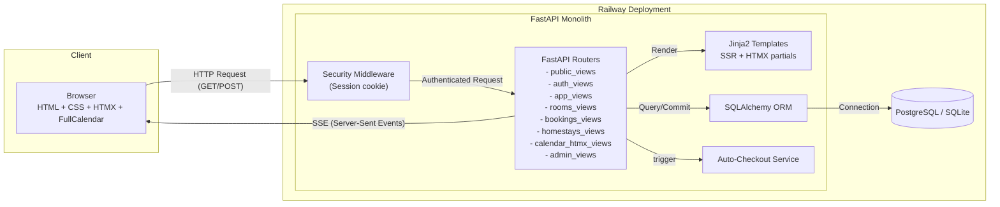
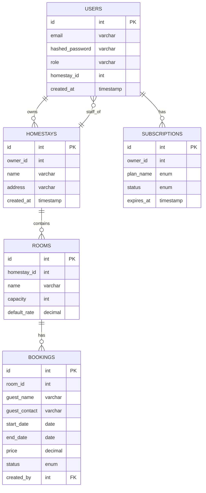

### High-Level Architecture Diagram

This diagram illustrates the overall structure of the application, showing the main components and how they interact.

### Low-Level Architecture (Data Model) Diagram

This Entity-Relationship (ER) diagram provides a detailed look at the database schema, including the tables, their fields, and the relationships between them.

